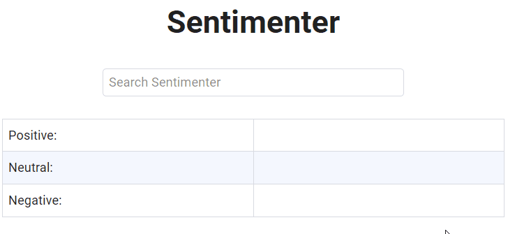

# rapid-api-combine

Copy the `.env.template` file and rename it to `.env` and provide a
https://rapidapi.com API key.

```bash
npm install
npm start
```

Go to http://localhost:3002



## Preface
Does a basic analysis of the sentiment around a given topic by combining the APIs below:
- [Free News](https://rapidapi.com/newscatcher-api-newscatcher-api-default/api/free-news/)
- [Text Sentiment Analysis](https://rapidapi.com/fyhao/api/text-sentiment-analysis-method)

## TODO
- [ ] Sometimes the sentiment analyzer will fail, the exact cause has yet to be identified
- [ ] Unit test
- [ ] Integration test
- [ ] Make it fancy
    - [ ] Convert to Vue or React
    - [ ] Use framework (Material-UI?)

